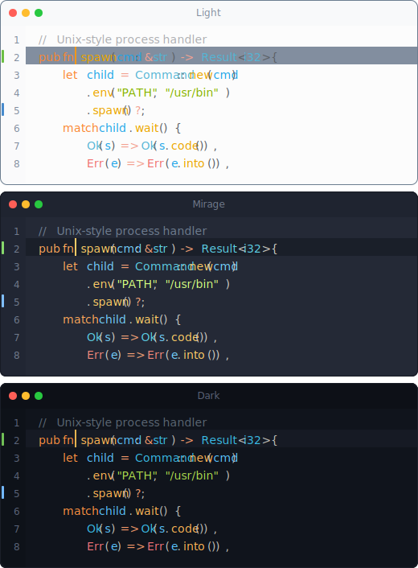
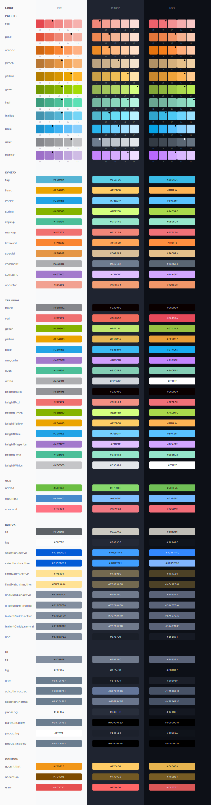

<p align="center">
  <a href="https://ayutheme.com">Website</a> •
  <a href="#install">Install</a> •
  <a href="#usage">Usage</a> •
  <a href="#ports">Ports</a>
</p>

<p align="center">
  <a href="https://www.npmjs.com/package/ayu">
    
  </a>
  <a href="https://www.npmjs.com/package/ayu">
    
  </a>
</p>

---

**ayu** is a bright color theme and comes in three versions — _dark_, _mirage_, and _light_ — for all-day comfortable work. Colors for building your own themes and tools.

<p align="center">
  
</p>

## Install

```bash
npm install ayu
```

## Usage

```typescript
import { dark, light, mirage } from 'ayu'

// Access colors
dark.syntax.keyword.hex()    // '#FF8F40'
light.editor.bg.hex()        // '#FCFCFC'
mirage.common.accent.hex()   // '#FFCC66'

// RGB values
dark.syntax.string.rgb()     // [170, 217, 76]
```

## Palette

<details>
  <summary>Full palette</summary>

  
</details>

## Ports

ayu is available for:

- [Sublime Text](https://github.com/dempfi/ayu)
- [VS Code](https://github.com/ayu-theme/vscode-ayu)
- [and more...](https://ayutheme.com)

---

<p align="center">
  <a href="https://ayutheme.com">ayutheme.com</a> •
  <a href="https://ko-fi.com/dempfi">Buy me a coffee</a>
</p>
